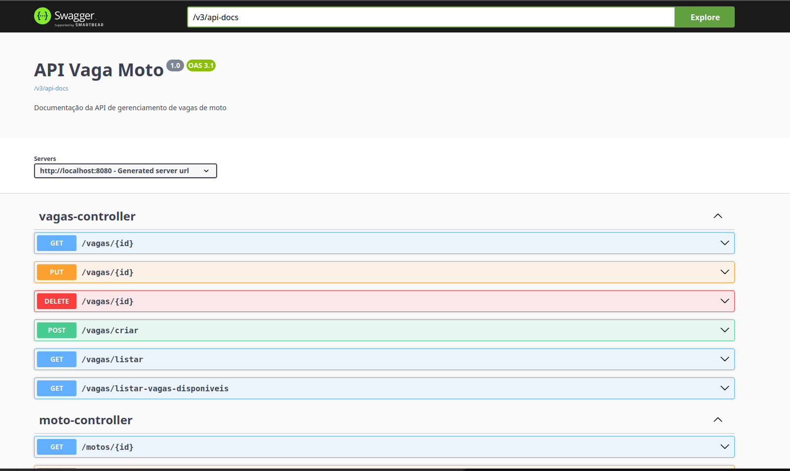

RM:556760 Adriano Barutti
Rm:557245 Vitor Kenzo
## Getting Started

Welcome to the Vagamoto project! This project is a parking space management system built with Spring Boot and Java. It allows users to manage parking spaces and vehicles, providing a RESTful API for easy integration.

## Prerequisites
- Java 17 or higher
- Maven 3.6 or higher
- Redis (for caching)
- SQLite (for testing)
- Docker (optional, for running Redis)
- IDE (e.g., IntelliJ IDEA, Eclipse, or Visual Studio Code)
- Postman or any other API testing tool


## Folder Structure

```plaintext
├── src
│   ├── main
│   │   ├── java
│   │   │   └── com
│   │   │       └── vagamoto
│   │   │           ├── controller
│   │   │           ├── dto
│   │   │           ├── exception
│   │   │           ├── model
│   │   │           ├── repository
│   │   │           ├── service
│   │   │           └── VagamotoApplication.java
│   │   └── resources
│   │       ├── application.properties
│   │       ├── application.yml
│   │       └── static
│   └── target
│       └── classes
│  
|── pom.xml
├── README.md
├── .gitignore
├── .mvnw
```


## Dependency Management

This project uses Maven for dependency management. The `pom.xml` file contains all the dependencies required for the project.

The main dependencies are:
- Spring Boot Starter Web: For building web applications, including RESTful APIs.
- Spring Boot Starter Data JPA: For accessing databases using JPA.
- Spring Boot Starter Redis: For using Redis as a caching solution.
- Spring Boot Starter Validation: For validating request bodies.

## Running the Code
- Open the terminal in VS Code, execute the following command to run the project:
```bash
./mvnw clean package
```
- After the build is successful, you can run the project using:
```bash
./mvnw spring-boot:run
```
- Alternatively, you can run the project directly from your IDE by running the `VagamotoApplication.java` class.

- If you are using IntelliJ IDEA, right-click on the `VagamotoApplication.java` file and select `Run 'VagamotoApplication.main()'`.

## API Documentation
This project provides a RESTful API for managing parking spaces and vehicles. 
The API allows you to create, read, update, and delete parking spaces and vehicles.

Acess the API documentation at `http://localhost:8080/swagger-ui/index.html` after running the application.




## Redis Configuration
This project uses Redis for caching and storing data.
Make sure you have Redis installed and running on your machine.


You can download Redis from the official website: [Redis.io](https://redis.io/download)

Or you can use Docker to run Redis:

```bash
docker run --name redis -p 6379:6379 -d redis
```

Or you can use Redis Cloud, which is a managed Redis service provided by various cloud providers, this site [Redis Cloud](https://redis.com/redis-enterprise-cloud/) provides a free tier for development and testing purposes.


You need to set the Redis host and port in the `application.yml` file:

```yaml
spring:
  redis:
    host: localhost
    port: 6379
    username: default
   password: your_password
```

## Database Configuration
This project uses H2 database for development and testing purposes.

You need to set the properties spring.jpa.hibernate.ddl-auto to `create` in the file 
`src/main/resources/application.properties` to create the database schema automatically.

```properties
# Hibernate properties
spring.jpa.hibernate.ddl-auto=create
```

This project utilize SQLite for testing purposes, you can change the database to H2 or any other database by changing the `application.properties` file.

```properties
# Data source configuration
spring.datasource.driverClassName=org.h2.Driver
spring.datasource.url=jdbc:h2:file:./data/vagamoto
spring.datasource.username=root
spring.datasource.password=root
```

## How to use API

1. Create a new vacancy space
   - Endpoint: `POST /espaco-vaga/criar`
   - Request Body: `{"nome": "Espaço 1", "localizacao": "Rua A", "tipo": "Moto", "ocupado": false}`

2. List all vacancy spaces
   - Endpoint: `GET /espaco-vaga/listar`
   - Response: `[{ "id": 1, "nome": "Espaço 1", "localizacao": "Rua A", "tipo": "Moto", "ocupado": false }]`

3. Search for a vacancy space by ID
   - Endpoint: `GET /espaco-vaga/buscar/{id}`
   - Response: `{"id": 1, "nome": "Espaço 1", "localizacao": "Rua A", "tipo": "Moto", "ocupado": false}`

4. Update a vacancy space
    - Endpoint: `PUT /espaco-vaga/atualizar/{id}`
    - Request Body: `{"nome": "Espaço 1 Atualizado", "localizacao": "Rua B", "tipo": "Carro", "ocupado": true}`

5. Delete a vacancy space
    - Endpoint: `DELETE /espaco-vaga/deletar/{id}`
    - Response: `{"message": "Espaço de vaga deletado com sucesso!"}`

6. Create a new vehicle
    - Endpoint: `POST /veiculo/criar`
    - Request Body: `{"placa": "ABC1234", "modelo": "Fusca", "cor": "azul", "ano": 1970, "tipo": "Carro"}`#
